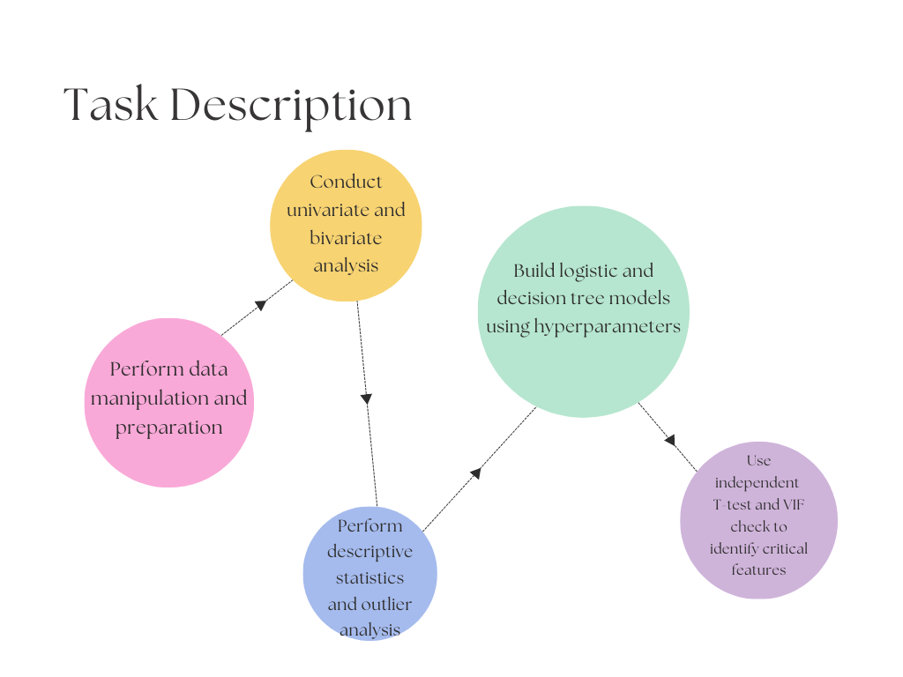
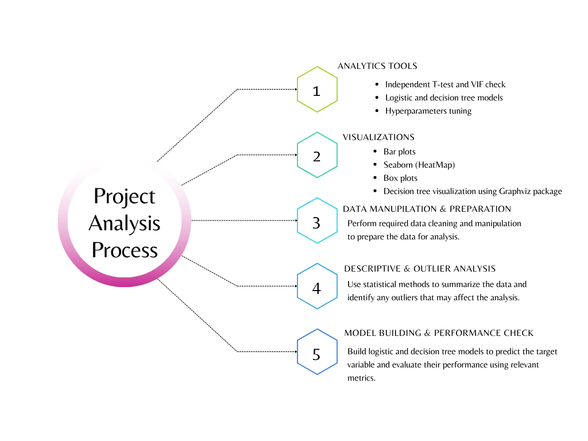

# RiskMinder: Real-time-Credit-Risk-Management-through-Data
   Full Project with Code please visit: https://deepnote.com/@the-digi-life/RiskMinder-Real-time-Credit-Risk-Management-through-Data-Analysis-bd225682-a1e5-463c-a4b6-e205932a885e

Credits Risk Analysis: 

        The objective of this case study is to help a leading bank predict which customers are most likely to default on a loan. To achieve this, the bank wants to analyze the behavior of existing customers in order to make informed decisions on whether to extend credit to new customers. Credit scoring is the set of decision models and techniques that aid lenders in granting consumer credit, and this project will utilize various credit scoring techniques to achieve the desired outcome. By analyzing data related to credit cards, auto loans, home loans, and other personal loan products, the bank can identify patterns and trends that indicate higher risk of default. This will enable the bank to make more informed decisions about extending credit to new customers and minimize the risk of default.

Objectives:
- The objective of the case study is to help a leading bank predict customers who are most likely to default on a loan.

- The bank wants to analyze the behavior of existing customers to make decisions on whether to extend credit to new customers.

- Credit scoring techniques will be used to achieve this objective.

- Data related to various loan products, including credit cards, auto loans, home loans, and personal loans, will be analyzed to identify patterns and trends indicating a higher risk of default.

- The ultimate goal is to enable the bank to make more informed decisions about extending credit to new customers and minimize the risk of default.

    An ROC (receiver operating characteristic) curve is a graphical representation of a classification model's performance at all classification thresholds. It shows the trade-off between the sensitivity (true positive rate) and specificity (true negative rate) of the model at different thresholds.

    To find the best cutoff point, we need to identify the point on the ROC curve that maximizes the model's sensitivity and specificity simultaneously. This point is often referred to as the "optimal threshold" or "cutoff point". At this point, the model's performance is considered to be the best in terms of correctly identifying both positive and negative cases.

    Choosing a threshold that maximizes both sensitivity and specificity helps to minimize bias towards either positives or negatives, leading to a more balanced and accurate classification model. While this threshold may not always provide the highest prediction in the model, it ensures that the model is performing at its best across all possible classification thresholds.

Model Building and Model Diagnostics:
    Logistics Regression & Decision Tree Classification:
    - Train/Test Split: Splitting data into training and testing sets to check the model's performance on unseen data.

    - Variable Significance: Assessing significance of each variable using statistical tests to determine their association with the outcome variable.

    - Gini and ROC/Concordance: Measures of the model's performance - Gini coefficient measures classification accuracy, ROC curve measures sensitivity vs specificity     trade-off, concordance measures predictive ability.

    - Classification Table Accuracy: Evaluate model performance using classification table to compare predicted vs actual values and calculate accuracy.

Decision Tree Classifier: Same analysis as logistic regression with additional use of measures like Gini index, Chi-square or Information gain to determine significant variables. ROC curves and concordance analysis may not be applicable as the output is categorical. Confusion matrix can also be used to evaluate model performance.

Observations: 
The analysis shows that the gain chart indicates that 90% of the defaulters who are likely to default on the loan can be identified by analyzing just 50% of the total customers. The lift chart indicates that by selecting 20% of the records based on the model, one can expect 2.7 times the total number of defaulters to be found than by randomly selecting 20% of the data without a model. The winning model should be saved using the standard method of serializing objects in Python, which is the pickle operation, to allow for future reuse in testing the model on new data, comparing multiple models, or other purposes.

Later you can load this file to deserialize your model and use it to make new predictions.

Installation:
    The Installation process will get you a copy of the project up and running on your local machine for development and testing purposes:
  1. Clone or download the project into your local machine.
  2. Unzip the project folder.
  3. Open the source file CreditRiskAnalytics-DefaultModel using Deepnote and execute the file.
  4. Instead of step 3, use the classification model loaded in the pickle to classify default customers.

Prerequisites
The following list summarizes the packages/softwares used in this project. These are the softwares/packages you need to install before executing the project file.
   Anaconda v – 5.2.0 (py 36_3)
   Python v – 3.6.5
   Packages (Packages that are not part of anaconda distribution, need to install using pip installer)
   export_graphviz (pip install graphviz)
   pydot graphviz (pip install pydot graphviz)
   pydotplus (pip install pydotplus)

Repository Contains
 - Data Folder -- Contains Raw Data Files
 - Problem Statement -- Case Study Business Problem Statement
 - CreditRiskAnalytics Summary -- Credit Risk Analytics Project 

Summary Report
 - CreditRiskAnalytics-DefaultModel -- Project Source Code File
 - LogisticRegression-KSChart -- Excel Template File for Lift and Gain 

Charts
 - License & CopyRight
 - Copyright (c) 2023 JennyCheng Licensed under the Apache License 2.0

Trademarks
All other trademarks referenced herein are the property of their respective owners.
